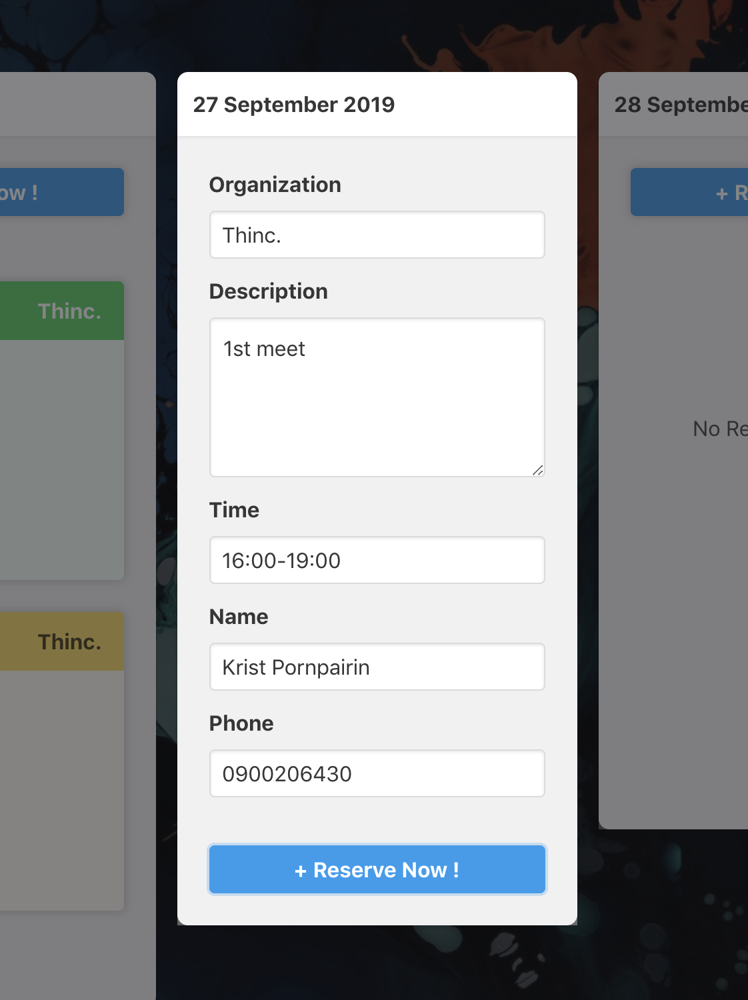

# ENGINX reservation
using [Svelte]() front end with [Pug]() preprocess custom in [Rollup]().

some preprocess in **.pug** file is bug, so we will backward to **.svelte** for some file.

---

### TODO

make **VS Code** able to inject highlight **JS/TS** and **SASS/SCSS** with magicle custom extension.
